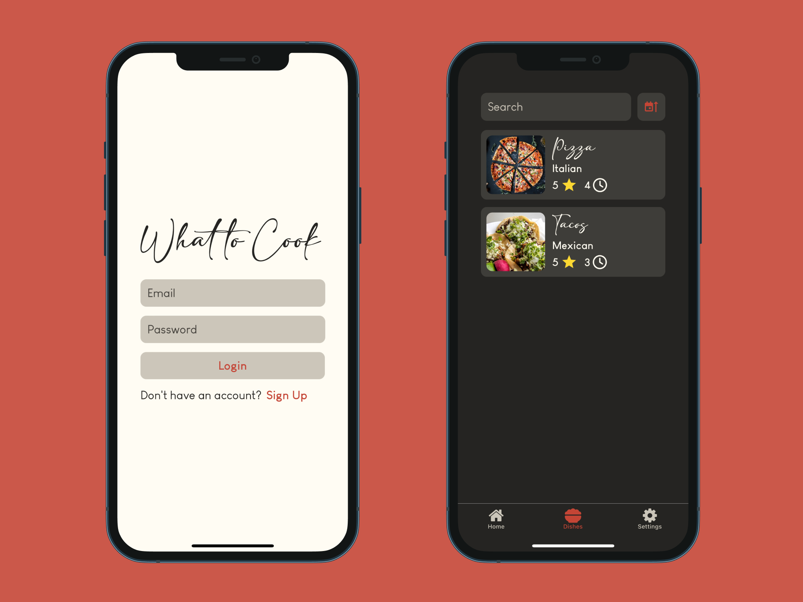

# What To Cook

Dish tracking and recommendation mobile app for home cooks.

Built with Expo, React Native, and TypeScript.

## About

What To Cook allows users to track their dishes by entering the dish name, adding an image, providing a rating, and specifying the cooking time. The app offers recommendations such as dishes with similar ingredients to what users already have, quick dishes, and the best-rated dishes.

Accompanied by [What To Cook Backend](https://github.com/siddhp1/What-To-Cook-Backend).

## Setup

1. **Download the latest release:**

    Go to the [Releases](https://github.com/siddhp1/What-To-Cook/releases/) page and download the `what-to-cook.apk` file.

2. **Sideload app:**

    Transfer the downloaded `what-to-cook.apk` file to your Android device.

    On your Android device, locate the `what-to-cook.apk` file using a file manager app and tap on it to start the installation process. 

## Usage

1. **Create an account:**

    Open the app and create an account or log in.

2. **Add dishes:**

    Add dishes by entering their name, uploading an image, providing a rating, and specifying the cooking time.

3. **View dishes:** 

    Visit the dishes tab to view dishes that you have added.

4. **Explore recommendations:**

    Explore recommendations for dishes based on your ingredients, quick recipes, or top-rated dishes.

## License

This project is licensed under the MIT License.
